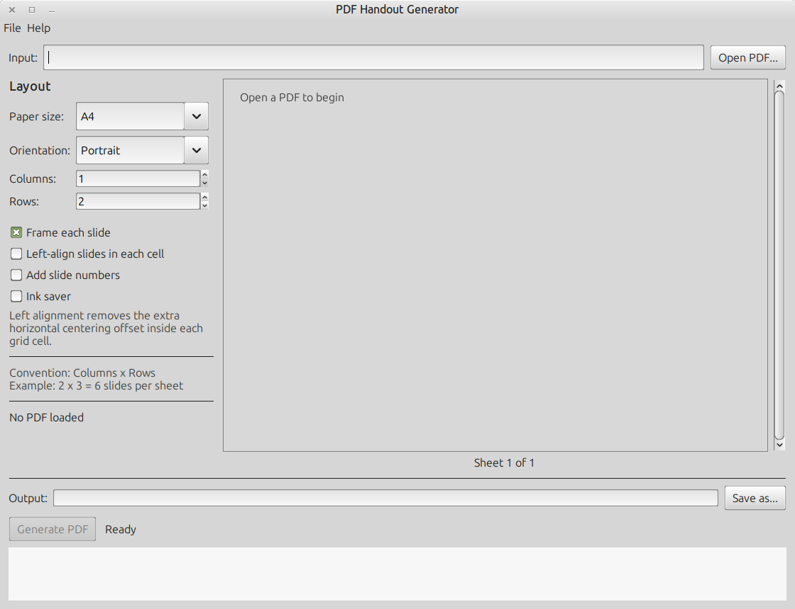

# PDF Handout Generator

This version uses Swing/AWT instead of JavaFX. It creates one executable fat JAR containing the application, Apache PDFBox, and PDFBox's Java dependencies.

- Layout panel anchored at the top; output row aligned consistently with the input row.




## Requirements

- Java 21 or newer
- Maven only for building

End users do **not** need Maven.

## Build from source

Building requires Java 21+, Maven, and an internet connection for the first dependency download. Linux/macOS also requires the `zip` command; Windows uses PowerShell.

### Linux or macOS

```bash
chmod +x build.sh
./build.sh
```

### Windows

Double-click `build.bat`, or run it from Command Prompt.

The build process:

1. Runs `mvn clean package` to create the executable fat JAR.
2. Generates `run.sh`, `run.command`, and `run.bat`.
3. Adds the fat JAR, README, and licence to a release archive.
4. Deletes Maven classes, the thin original JAR, the staging directory, and all other intermediate artifacts.

After a successful build, `target/` contains exactly one release file:

```text
target/pdf-handout-generator-v1.zip
```

Inside that ZIP:

```text
pdf-handout-generator-v1/
├── pdf-handout-generator-v1.jar
├── run.sh
├── run.command
├── run.bat
├── README.md
└── LICENSE
```

End users extract the ZIP and use the launcher for their operating system. They need Java 21 or newer, but do not need Maven.

## Credits

- Concept, product direction, vibe-coding, and maintenance: Dennis Khong
- Implementation generated by: M365 Copilot (GPT-5 reasoning model)
